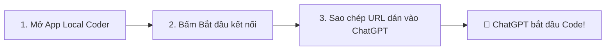

# 🛡️ ChatGPT Local Secure

> **Máy chủ MCP (Model Context Protocol) Local bảo mật cao, đa nền tảng, giúp ChatGPT đọc/sửa code, chạy task và thao tác Git trên máy tính của bạn một cách an toàn tuyệt đối.**

[](#yêu-cầu)
[](#kiểm-tra-chất-lượng)
[](#khởi-động-nhanh)
[](#bảo-mật)

---

## 🌟 6 Tính Năng Nổi Bật Mới

| Icon | Tính năng | Chi tiết hoạt động |
| :---: | :--- | :--- |
| 🗂️ | **Recent Projects Switcher** | Lưu lịch sử các thư mục dự án; chuyển đổi tức thì **1-Click** ngay trên thanh Dashboard mà không cần chọn lại file. |
| 🛡️ | **Visual Diff & 1-Click Rollback** | Xem chi tiết so sánh code ChatGPT đã thêm (`+ xanh`) hoặc xóa (`- đỏ`) qua từng Checkpoint; hoàn tác an toàn **1-Click**. |
| 🍏 | **macOS Menu Bar Tray App** | Menu thu nhỏ tiện ích trên thanh trạng thái macOS (Menu Bar) với icon khiên 3D, hỗ trợ ẩn vào Tray khi bấm `Cmd+W` / `(X)`. |
| ⚡ | **Auto-Detect Project Tasks** | Tự động nhận diện cấu trúc dự án (**Node.js/npm, Python/pytest, Rust/cargo, Go, Git**) và gợi ý task thêm vào Allowlist 1-Click. |
| 📡 | **Realtime Activity Stream (SSE)** | Luồng Server-Sent Events `/api/events` cập nhật realtime và hiển thị thông báo Toast góc màn hình mỗi khi AI gọi tool. |
| 🌐 | **Cố định URL với Ngrok / Cloudflare** | Hỗ trợ gán Domain cố định (Custom Domain) cho Ngrok / Cloudflare để không bao giờ phải cập nhật lại link trên ChatGPT. |

---

## 🚀 Khởi Động Nhanh (1-Click)

Yêu cầu máy đã cài **[Node.js 22+](https://nodejs.org)**. Sau đó mở thư mục dự án và nhấp đúp:

| Hệ điều hành | File chạy nhanh 1-Click | Lệnh Terminal tương đương |
| :--- | :--- | :--- |
| 🍏 **macOS** | Nhấp đúp file **`Start ChatGPT Local.command`** | `./app.sh` hoặc `corepack pnpm app` |
| 🪟 **Windows** | Nhấp đúp file **`Start ChatGPT Local.cmd`** | `.\app.ps1` hoặc `corepack pnpm app` |
| 🐧 **Linux** | Chạy file **`./start.sh`** | `./app.sh` hoặc `corepack pnpm app` |

> 💡 **Tự động 100%:** Trong lần chạy đầu tiên, app sẽ tự cài dependency, tự sinh token bảo mật, tạo cấu hình và mở trực tiếp ứng dụng Dashboard.

---

## 📖 Hướng Dẫn Sử Dụng (3 Bước Đơn Giản)



### 🔹 Bước 1: Chọn Thư Mục Dự Án & Quyền Hạn
1. Trên giao diện Dashboard (thẻ **BƯỚC 2**), bấm **📁 Chọn thư mục** để chỉ định project bạn muốn ChatGPT làm việc.
2. Tích chọn các quyền bạn muốn cấp:
   - **Tự sửa code + chạy task + Git local:** Cho phép ChatGPT tạo, chỉnh sửa file và chạy lệnh trong Allowlist.
   - **Quyền nâng cao (Tùy chọn):** Xóa file, Git push/pull, hoặc chạy Shell tùy ý (chỉ bật khi tin tưởng).
3. Bấm **Lưu cài đặt project**.

### 🔹 Bước 2: Mở Kết Nối Tunnel
1. Tại thẻ **BƯỚC 1**, chọn nhà cung cấp tunnel:
   - **Ngrok** *(Khuyên dùng)*: Kết nối siêu ổn định, hỗ trợ gán Domain cố định miễn phí.
   - **Cloudflare**: Hoạt động không cần tài khoản hoặc dùng Named Tunnel Token.
   - **Pinggy**: Kết nối trực tiếp qua SSH không cần cài thêm CLI.
2. Bấm **▶ Bắt đầu kết nối**.

### 🔹 Bước 3: Dán URL vào ChatGPT
1. Bấm nút **Sao chép URL** (Ví dụ: `https://your-domain.ngrok-free.app/mcp/TOKEN...`).
2. Mở **ChatGPT** $\rightarrow$ **Settings** $\rightarrow$ **Apps / Connectors** $\rightarrow$ **Add new app**.
3. Dán URL vừa sao chép $\rightarrow$ Hoàn tất! Giờ đây bạn có thể yêu cầu ChatGPT đọc, sửa lỗi và phát triển dự án của bạn.

---

## 💻 Bảng Lệnh Terminal (Command Reference)

Dành cho nhà phát triển muốn chạy và kiểm soát bằng dòng lệnh:

| Lệnh Terminal | Mô tả chức năng | Khi nào sử dụng |
| :--- | :--- | :--- |
| `corepack pnpm app` | Khởi động Local Server và mở Native Dashboard | Chạy ứng dụng hàng ngày |
| `corepack pnpm dev` | Chạy server ở chế độ phát triển (Auto-reload) | Khi chỉnh sửa mã nguồn backend/frontend |
| `corepack pnpm build` | Biên dịch toàn bộ TypeScript sang JavaScript (`dist/`) | Trước khi đóng gói hoặc chạy production |
| `corepack pnpm typecheck` | Kiểm tra toàn diện lỗi kiểu dữ liệu TypeScript | Kiểm tra tính đúng đắn của code |
| `corepack pnpm test` | Chạy toàn bộ 34+ Unit Tests của hệ thống | Kiểm thử hồi quy logic an toàn |
| `corepack pnpm verify` | Cổng kiểm tra tổng: Typecheck + Test + Build + Smoke + Pack | Trước khi commit / merge mã nguồn |
| `node scripts/build-mac-app.mjs` | Biên dịch lại Native macOS App (`Local Coder.app`) | Sau khi sửa đổi mã nguồn Swift native |

---

## 🔒 Bảng Phân Quyền Bảo Mật (Least-Privilege)

Hệ thống tuân thủ nghiêm ngặt nguyên tắc đặc quyền tối thiểu (**Least-Privilege Security Contract**):

| Khả năng (Capability) | Mặc định | Cơ chế bảo vệ |
| :--- | :---: | :--- |
| 📖 **Đọc code trong Workspace** | ✅ **BẬT** | Chỉ đọc trong thư mục đã chọn; chặn hoàn toàn Symlink trỏ ra ngoài. |
| ✏️ **Sửa code & Tạo Checkpoint** | ⚡ **Tùy chọn** | Tự động tạo Checkpoint trước mỗi lần sửa; hỗ trợ xem Diff và Rollback 1-click. |
| ⚡ **Chạy Task Allowlist** | ⚡ **Tùy chọn** | Chỉ chạy các lệnh đã khai báo trong `.local-coder/tasks.json`, không chạy qua shell. |
| 🗑️ **Xóa file / Phục hồi** | ❌ **TẮT** | Ngăn chặn hành vi xóa dữ liệu ngoài ý muốn trừ khi được cấp quyền rõ ràng. |
| 🚀 **Git Remote (Pull / Push)** | ❌ **TẮT** | Ngăn chặn gửi mã nguồn ra ngoài remote trừ khi người dùng chủ động cho phép. |
| 💻 **Shell tùy ý** | ❌ **TẮT** | Bị vô hiệu hóa hoàn toàn theo mặc định để đảm bảo an toàn tuyệt đối cho máy tính. |
| 🔑 **Đọc file nhạy cảm (`.env`, key)** | ❌ **TẮT** | Tự động ẩn các file chứa secret, mật khẩu và token. |

---

## 🍏 Mẹo & Phím Tắt Tiện Ích trên macOS

* **Ẩn vào Menu Bar:** Bấm nút **`(X)` màu đỏ** hoặc nhấn **`Cmd + W`** $\rightarrow$ Cửa sổ sẽ ẩn đi, icon trên Dock biến mất, app vẫn chạy ngầm trên thanh Menu Bar trên cùng `🛡️`.
* **Mở lại giao diện:** Nhấp vào icon **`🛡️` trên Menu Bar** $\rightarrow$ Chọn **Mở Dashboard**.
* **Thoát hoàn toàn:** Nhấn **`Cmd + Q`** hoặc chọn **Thoát Local Coder** trên Menu Bar $\rightarrow$ App sẽ tự động tắt và giải phóng toàn bộ tiến trình Terminal / Port 3400/3401.
* **Tắt từ Terminal:** Khi bạn bấm **`Ctrl + C`** trong Terminal, icon Menu Bar và cửa sổ macOS cũng sẽ tự động đóng ngay lập tức.

---

## 📁 Cấu Trúc Thư Mục Dự Án

```text
├── Local Coder.app/        # Ứng dụng native macOS tích hợp WebKit & Menu Bar Tray
├── src/
│   ├── cli/                # Khởi chạy Desktop app, tunnel & terminal command
│   ├── http/               # Server HTTP, Dashboard UI, SSE events, Auth & Admin API
│   ├── infra/              # Checkpoint Snapshot, Audit Log (EventEmitter), Process tree
│   ├── mcp/                # Máy chủ MCP Protocol, Tool Registry & Session Manager
│   ├── native/mac/         # Mã nguồn Swift native cho macOS Menu Bar & Dock Icon
│   ├── security/           # PathPolicy (chặn Path Traversal, symlink), Auth, Rate Limit
│   └── services/           # Quản lý Tunnel (Ngrok/Cloudflare), Task Runner, Task Presets
├── scripts/                # Script khởi động 1-Click, build native app, generate icons
└── test/                   # Bộ test suite tự động kiểm tra an toàn và tính năng
```

---

<div align="center">
  <sub>Phát triển với tiêu chuẩn bảo mật cao nhất dành cho cộng đồng lập trình viên AI.</sub>
</div>
